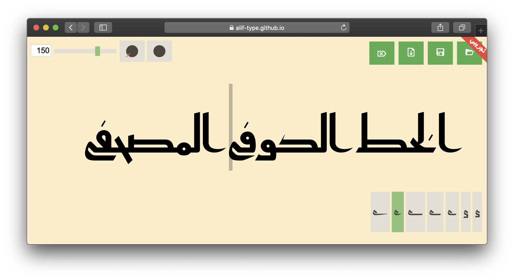
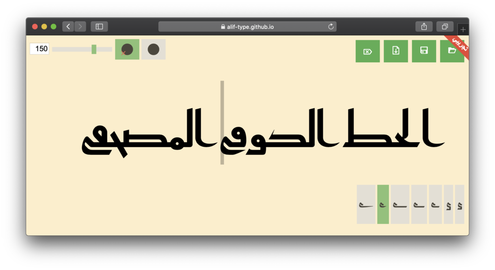
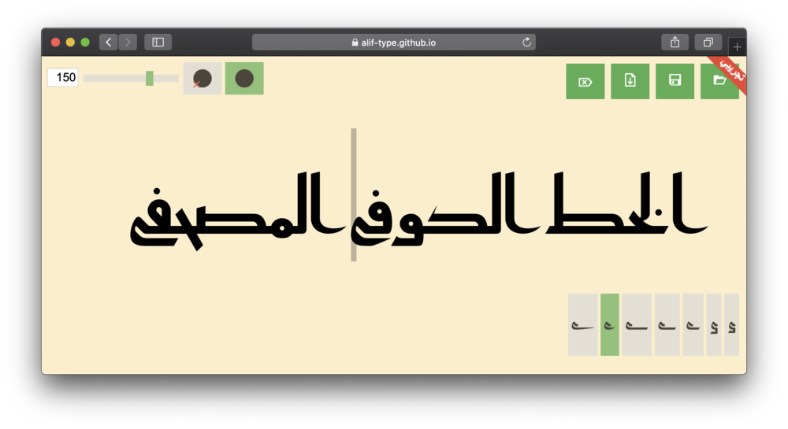
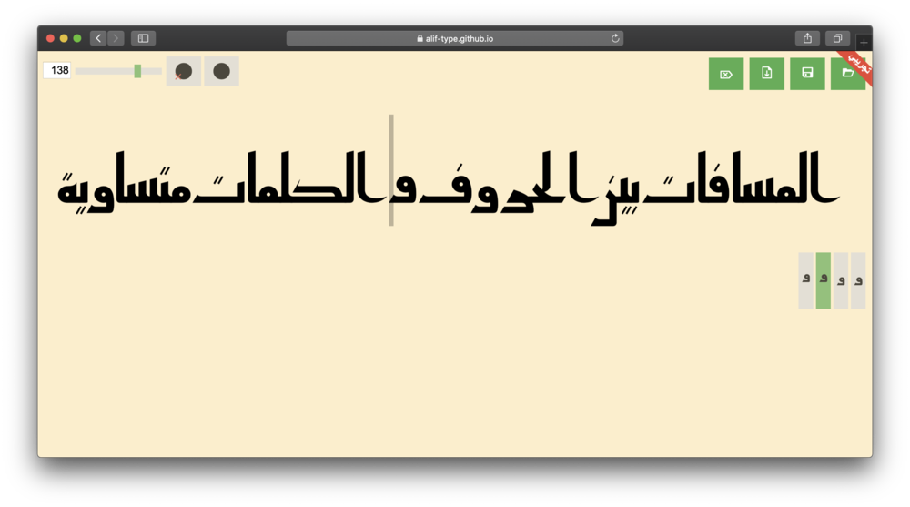
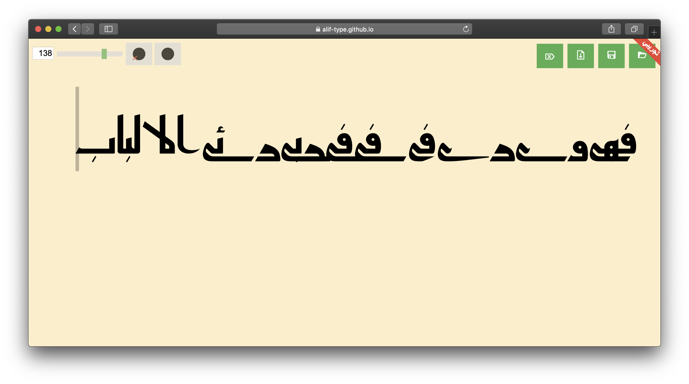

«قاهري» هو خط حاسوبي [كوفي][1] مبني على القاعدة الحديثة لخط كوفي المصاحف التي
وضعها الأستاذ [محمد عبد القادر][2] رحمه الله.

يأتى الاسم «قاهري» من مدينة القاهرة بمصر، محاكاة لتسمية الخطوط القديمة على
أسماء المدن التي ظهرت بها.

«قاهري» مشروع حر مفتوح المصدر، ويرحب بالجميع لاستخدامه وتعديله تحت بنود
[الإصدارة ١٫١ من رخصة الخطوط المفتوحة][5].

## التطبيق
يحتوي الخط على تنويعات لكثير من حروفه، ويفترض أن يتاح للمستخدم اختيار هذه
التنويعات في أي تطبيق يدعم خطوط أوبن تيب. للأسف تعاني كثير من التطبيقات من ضعف
دعمها لهذه الخصائص (بعضها لا يتيح اختيار التنويعات، والبعض الآخر يتيحه لكن
واجهة الاستخدام سيئة، كما أن بعضها لا يسمح باختيار تنويعة لكل حرف على حدة)، لذا
يوفر خط «قاهري» تطبيق وب يعمل على المتصفحات الحديثة ويتيح الوصول بسهولة إلى
مختلف تنويعات الحروف ومميزات الخط الأخرى.

يمكن استخدام التطبيق من بزيارة [صفحته][4] والكتابة في المنطقة المخصصة للكتابة.
ستظهر أسفل النص التنويعات المتاحة للحرف الذي يسبق مؤشر النص (المستطيل الرمادي).
النقر على أي تنويعة سيستخدمها بدل الشكل الحالي للحرف:

شريط التمرير ومربع الرقم المجاور له يتحكمان في حجم النص.

يوجد زران للتحكم في النقاط، زر  يحول إلى الصورة المهمَلة (غير
المنقوطة) من الحروف، لتحاكي المخطوطات الكوفية القديمة.

أما زر  فيستبدل بالنقاط
المستطيلة نقاطا مستديرة كما هو الشائع في شكل النقاط اليوم.

يتيح التطبيق تصدير ملف SVG للنص المكتوب يمكن تعديله في أي من تطبيقات الرسوم
المتجهية. الضغط على زر  سينزّل الملف.

يمكن حفظ النص الحالي وكل التنويعات المختارة بضغط زر
، ويمكن تحميل النص مرة أخرى بضغط زر
.

ضغط زر  سيمسح كل النص المكتوب.

### التنصيب على الأجهزة المحمولة
يعمل التطبيق حتى بدون اتصال بالإنترنت، كما يدعم متصفحات الهواتف المحمولة
والشاشات الصغيرة. يمكن أيضا تنصيب التطبيق على الأجهزة المحمولة للوصول له آسرع
دون الحاجة لفتح المتصفح.

على أجهزة أندرويد، افتح [صفحة التطبيق][4] في متصفح «جوجل كروم»، ثم اذهب إلى
القائمة واختر __الإضافة إلى الشاشة الرئيسية__، وستظهر نافذة لإضافة التطبيق إلى
الشاشة الرئيسية:

على أجهزة أبل المحمولة، افتح [صفحة التطبيق][4] في متصفح «سافاري» ثم انقر على
أيقونة التنزيل، ثم __إضافة إلى الصفحة الرئيسية__، وستظهر نافذة لإضافة التطبيق
إلى الصفحة الرئيسية:

## خصائص الخط
يسعى الخط إلى الالتزام بالقواعد التي وضعها الأستاذ محمد عبد القادر، ومن هذا أن
المسافات بين الحروف، سواء متصلة أو منفصلة، وكذلك المسافات بين الكلمات حوالي نصف
سمك الجزء الصاعد من حرف الألف. لا يفرِّق الخط إذا كانت المسافات بين الحروف أو بين
الكلمات. إدراج أكثر من مسافة (مسطرة المسافات) يزيد المسافة بين الحروف.

صممت أشكال الحروف المستخدمة مبدئيا في الخط لتتناغم مع بعضها، لكن بعض من تنويعات
الحروف الإضافية تحتاج حرصًا في استخدامها. فمثلا، الياء الراجعة قد تتداخل مع
الحروف السابقة عليها إذا كانت نازلة عن السطر، لذا ينبغي تفادي استخدامها في هذه
الحالة. يحاول الخط التصرف في بعض هذه الحالات، لكن قد لا يكون هذا ممكنا في كل
الحالات.

## المشاكل
بُنِي هذا الخط باستخدام بعض من تقنيات أوبن تيب المتقدمة التي قد لا تدعمها كل
البرمجيات بنفس الدرجة، وقد يتسبب هذا في أن يظهر الخط معيبا على بعض التطبيقات.

أداء التطبيق يحتاج إلى تحسين، لذا يفضل عدم استخدام نصوص طويلة عليه إذ قد يؤدي
هذا إلى تجمد المتصفح. لا يدعم التطبيق أكثر من سطر في الوقت الحالي، ولا يمكن
كتابة إلا سطر واحد فقط في كل مرة.

[1]: https://ar.wikipedia.org/wiki/خط_كوفي
[2]: https://ar.wikipedia.org/wiki/محمد_عبد_القادر_عبد_الله_(خطاط)
[3]: https://github.com/alif-type/qahiri/releases/latest
[4]: https://aliftype.com/qahiri/app/
[5]: https://github.com/alif-type/qahiri/blob/main/OFL.txt
